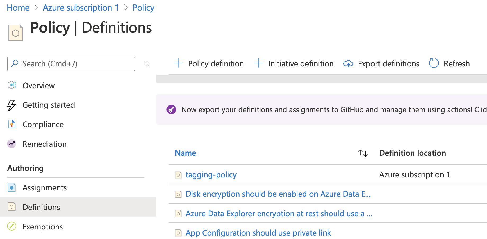
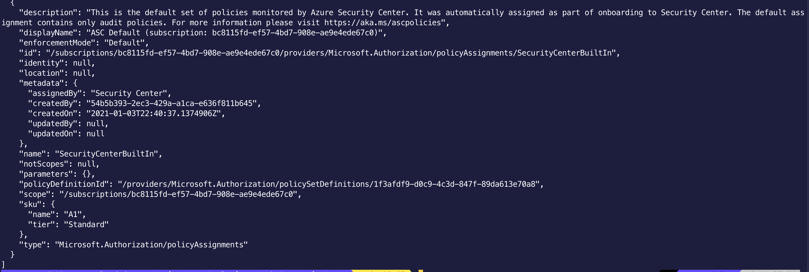
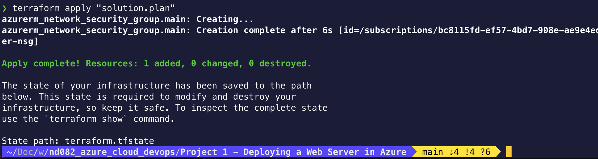

# Azure Infrastructure Operations Project: Deploying a scalable IaaS web server in Azure

### Introduction
For this project, you will write a Packer template and a Terraform template to deploy a customizable, scalable web server in Azure.

### Getting Started
1. Clone this repository

2. Create your infrastructure as code

3. Update this README to reflect how someone would use your code.

### Dependencies
1. Create an [Azure Account](https://portal.azure.com) 
2. Install the [Azure command line interface](https://docs.microsoft.com/en-us/cli/azure/install-azure-cli?view=azure-cli-latest)
3. Install [Packer](https://www.packer.io/downloads)
4. Install [Terraform](https://www.terraform.io/downloads.html)

### Instructions

1. Azure Credentials
     - Create a service principal
     - ``az ad sp create-for-rbac``
     - Retrieve ids
     - ``az ad sp create-for-rbac --query "{ client_id: appId, client_secret: password, tenant_id: tenant }"``
     - Populate server.json with ids. Replace client_id , client_secret and tenent_id
     
2. Configure webserver
      - In file variable.tf, you can configure number of vms by modifying the variable ``num_of_vms``.
      - Other variables are also configurable
      
3. Create and deploy a policy definition to deny the creation of resources that do not have tags
      - File azure_tag_policy.json contains the policy definition to deny the creation of resources that do not have tags.
      - The policy name is "tagging-policy". Policy was added through the Azure portal: Subscription > Policy > Definitions
      - Assign the policy definition using the Azure portal
      - Verify the policy by running CLI command ``az policy assignment list``
      - 

4. Resource group
      - Create Azure resource group by command ``az group create --location eastus --name packer-rg``
      - ``az image list``
      - ``az image delete -g packer-rg -n webserverPackerImage``
   
5. Packer - Create a server image using packer
      - Build the packer image server.json using command ``packer build server.json``
      
6. Terraform - Deploy
      - Initialize terraform by running ``terraform init``. Init is used to initialize a working directory containing Terraform configuration files. In this repo, Terraform files are main.tf and variables.tf
      - Create execution plan by running ``terraform plan -out solution.plan``
      - Execute the plan by running ``terraform apply "solution.plan"``
 
7. Cleanup
      - Destroy all the terraform resources by running ``terraform destroy``

### Output

Tagging Policy Screenshot acquired by running "az policy assignment list" in command line

Deployed Terraform Screenshot

