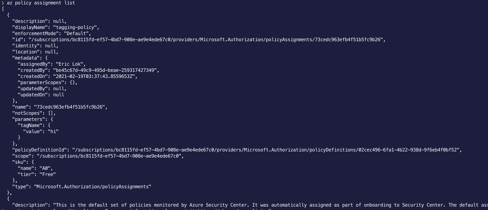

# Azure Infrastructure Operations Project: Deploying a scalable IaaS web server in Azure

### Introduction
For this project, you will write a Packer template and a Terraform template to deploy a customizable, scalable web server in Azure.

### Getting Started
1. Clone this repository

2. Create your infrastructure as code

3. Update this README to reflect how someone would use your code.

### Dependencies
1. Create an [Azure Account](https://portal.azure.com) 
2. Install the [Azure command line interface](https://docs.microsoft.com/en-us/cli/azure/install-azure-cli?view=azure-cli-latest)
3. Install [Packer](https://www.packer.io/downloads)
4. Install [Terraform](https://www.terraform.io/downloads.html)

### Instructions
File azure_tag_policy.json contains the policy definition to deny the creation of resources that do not have tags. The policy name is "tagging-policy". Policy was added through the Azure portal. 

### Output

Tagging Policy Screenshot acquired by running "az policy assignment list" in command line

